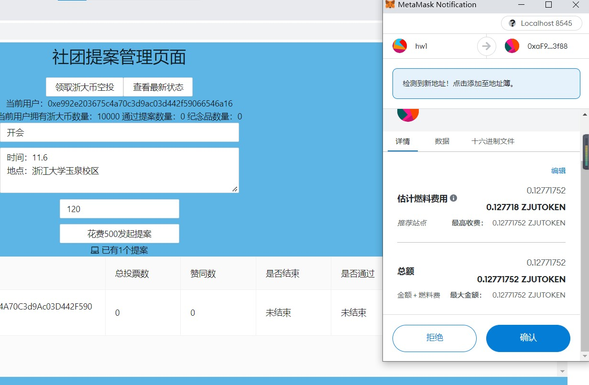

# ZJU-blockchain-course-2022

⬆ 可以️修改成你自己的项目名。

> 第二次作业要求（可以删除）：
> 
> 去中心化学生社团组织治理应用 
> 
> - 每个学生初始可以拥有或领取一些通证积分（ERC20）。 
> - 每个学生可以在应用中可以： 
>    1. 使用一定数量通证积分，发起关于该社团进行活动或制定规则的提案（Proposal）。 
>    2. 提案发起后一定支出时间内，使用一定数量通证积分可以对提案进行投票（赞成或反对，限制投票次数），投票行为被记录到区块链上。 
>    3. 提案投票时间截止后，赞成数大于反对数的提案通过，提案发起者作为贡献者可以领取一定的积分奖励。 
> 
> - (Bonus）发起提案并通过3次的学生，可以领取社团颁发的纪念品（ERC721）

**以下内容为作业仓库的README.md中需要描述的内容。请根据自己的需要进行修改并提交。**

作业提交方式为：提交视频文件和仓库的连接到指定邮箱。

## 如何运行

1. 在本地启动ganache应用（端口号8545）。

2. 在 `./contracts` 中安装需要的依赖，运行如下的命令：
    ```bash
    npm install
    ```
3. 在 `./contracts` 中编译合约，运行如下的命令：
    ```bash
    npx hardhat compile
    ```
4. 将后端代码部署在ganache链上，运行如下的命令：

    ```
    npx hardhat run scripts/deploy.ts --network ganache
    ```
5. 替换frontend\src\utils\abis中的MyERC20.json, MyERC721.json, StudentSocietyDAO.json文件为contracts\artifacts\contracts下的同名文件，在frontend\src\utils\contract-addresses.json中修改三个合约地址为中断打印出的对应地址。
6. 在 `./frontend` 中启动前端程序，运行如下的命令：
    ```bash
    npm run start
    ```

## 功能实现分析

简单描述：项目完成了要求的哪些功能？每个功能具体是如何实现的？

### 总体数据结构

```solidity
struct Proposal {
        uint32 index;      // index of this proposal
        address proposer;  // who make this proposal
        uint256 startTime; // proposal start time
        uint256 duration;  // proposal duration
        string name;       // proposal name
        string content; 	// proposal content
        uint32 voteNumber; // the number of votor
        uint32 agreement;	// the number of agreement
        bool isend;
        bool ispass;
        mapping (address => bool) option;		// the option of each member 
        mapping (address => bool) voterList;	// the list of members who has voted
    }
```

其中``option``字段没有实际使用，但进行了维护。后续可以拓展为记名投票。

### 具体功能

#### 初始领取一些通证积分

* 该功能参考了彩票系统demo中的设计，在``MyERC20``中继承ERC20并添加一个新的方法``airdrop``。通过``claimedAirdropPlayerList``记录已经领取的地址。限制每一个地址只能领取一次。

```solidity
contract MyERC20 is ERC20 {

    mapping(address => bool) claimedAirdropPlayerList;

    constructor(string memory name, string memory symbol) ERC20(name, symbol) {
        _mint(msg.sender, 100000);
    }

    function airdrop() external {
        require(claimedAirdropPlayerList[msg.sender] == false, "This user has claimed airdrop already");
        _mint(msg.sender, 10000);
        claimedAirdropPlayerList[msg.sender] = true;
    }
}
```

#### 发起提案

后端新建一个``Proposal``结构体，将提案名称、内容、持续时间传入，发起者为``msg.sender``，开始时间为``block.timestamp``，其他字段采用默认初始值。

```solidity
 	function newProposal(string memory name, string memory content, uint256 duration)public{
        studentERC20.transferFrom(msg.sender, address(this), PROPOSAL_AMOUNT);
        proposalNumber++;
        Proposal storage n = proposals[proposalNumber];
        n.index = proposalNumber;
        n.agreement = 0;
        n.content = content;
        n.duration = duration;
        n.isend = false;
        n.ispass = false;
        n.name = name;
        n.proposer = msg.sender;
        n.startTime = block.timestamp;
        n.voteNumber = 0;
    }
```

前端采用``onNewProposal``函数进行调用，从输入框中获取提案名称、提案内容、持续时间作为参数传入。调用后更新当前状态数据，刷新页面。

```js
const onNewProposal = async (title:string,content:string,duration:number) =>{
        if(account === '') {
            alert('You have not connected wallet yet.')
            return
        }

        if (StudentSocietyDAOContract && myERC20Contract) {
            try{
                await myERC20Contract.methods.approve(StudentSocietyDAOContract.options.address, proposalAmount).send({
                    from: account
                })
                await StudentSocietyDAOContract.methods.newProposal(title,content,duration).send({
                    from: account
                })
                const mc = await StudentSocietyDAOContract.methods.getMemberCount(account).call()
                setMemberCount(mc)
                const pn = await StudentSocietyDAOContract.methods.getProposalNumber().call()
                setProposalNumber(pn)
                const ind = await StudentSocietyDAOContract.methods.getProposalID().call()
                setDataIndex(ind)

            }catch (error: any) {
                alert(error.message)
            }
        }
    }
```

#### 对提案进行投票

后端主要采用``vote``函数进行投票，由前端传入投票的选择以及被投票提案的id，首先利用``check``函数进行状态的刷新。msg.sender将``VOTE_AMOUNT``浙大币转入本账户。对应提案的``voteNumber``加一，如果投票结果为true（赞同），则``agreement``加一。并将该用户的投票结果记录到对应``Proposal``的``option``中。

同时check函数也在前端与<查看最新状态>按钮相绑定。方便直接刷新。

```solidity
function vote(bool option,uint32 proposalid)public{
        check();
        studentERC20.transferFrom(msg.sender, address(this), VOTE_AMOUNT);
        Proposal storage _proposal = proposals[proposalid];
        
        // only once
        require(_proposal.voterList[msg.sender] == false, "This user has voted already");
        _proposal.voterList[msg.sender]=true;

        require((_proposal.isend!=true) && (_proposal.startTime + _proposal.duration > block.timestamp), "Voting has closed.");
        if(((_proposal.isend==false)))   //the proposal is not over
        {
            _proposal.voteNumber++;
            if(option == true)
            {
                _proposal.agreement++;
            }
            _proposal.option[msg.sender]=option;
        }
    }
```

#### 提案投票时间截止后，赞成数大于反对数的提案通过

check函数：遍历当前所有的协议，对于``isend``为``false``并且``startTime + duration <= block.timestamp``的提案继续进行处理，将``isend``置为true，判断同意者是否超过全部投票者的半数，超过则将ispass置为true。

```solidity
function check()public{
        for(uint32 i = 1; i<=proposalNumber; i++)
        {
            Proposal storage _proposal = proposals[i];
            // is not end 
            if((_proposal.isend==false)&&(_proposal.startTime + _proposal.duration <= block.timestamp)) 
            {
                _proposal.isend = true;
                if(_proposal.agreement > (_proposal.voteNumber/2))      // pass
                {
                    _proposal.ispass = true;
                    uint32 count = 2*_proposal.voteNumber-1;    // voteNumber != 0
                    studentERC20.transfer(_proposal.proposer, PROPOSAL_AMOUNT+ count*VOTE_AMOUNT);
                    memberCount[_proposal.proposer] ++;
                    if(memberCount[_proposal.proposer]%3==0)
                    {
                        myERC721.bonus(_proposal.proposer);
                    } 
                }
            }
        }
    }
```

#### 提案发起者在提案通过后领取一定的积分奖励

当check函数判断其为通过后，向提案发起者转账`` studentERC20.transfer(_proposal.proposer, PROPOSAL_AMOUNT+ count*VOTE_AMOUNT);``其中``count``为``2*voteNumber-1``，即投票者越多，该提案越有价值，通过时发起者奖励越多。

* check函数见上

#### 发起提案并通过3次的学生，可以领取社团颁发的纪念品（ERC721）

```solidity
mapping(address=>uint32) memberCount;
```

check函数中，当判断有一个提案通过时，对应用户提案通过数加一:``memberCount[_proposal.proposer] ++;``，每当``memberCount[_proposal.proposer]%3==0	``时，奖励其一个纪念品。（check函数见上）

同时在MyERC721中写bonus函数，用于发放奖励。

```solidity
contract MyERC721 is ERC721 {
    uint32 bn = 0;
    constructor(string memory name, string memory symbol) ERC721(name, symbol) {
    }

    function bonus(address to) external {
        _mint(to, bn);
        bn++;
    }
}
```

## 项目运行截图

放一些项目运行截图。

项目运行成功的关键页面和流程截图。主要包括操作流程以及和区块链交互的截图。

初始页面


连接钱包并领取空投


成功领取空投，此时该账户有浙大币10000


发起新提案


此时发起了新提案


通过提案前面的``+``号可以查看具体内容


用同一个账户进行投票，此处点击同意



成功花费50进行投票


等过了投票时间后查看最新状态，提案的状态刷新。该用户通过提案数变为1，浙大币增加 500 + 50*（2 * 1 - 1），变回10000.


该账号再次发布几个提案，对于最后一个名为aa的提案，用本账号与另外2个账号投2：1票


可以看到所有提案都正确执行，0xe99...账户有三个通过的提案，获得了一个ERC721的纪念品。

此时再次点击领取空投，右下角与上方均有报错


重复投票或结束后投票叶会报错


## 参考内容

课程的参考Demo见：[DEMOs](https://github.com/LBruyne/blockchain-course-demos)。

如果有其它参考的内容，也请在这里陈列。
